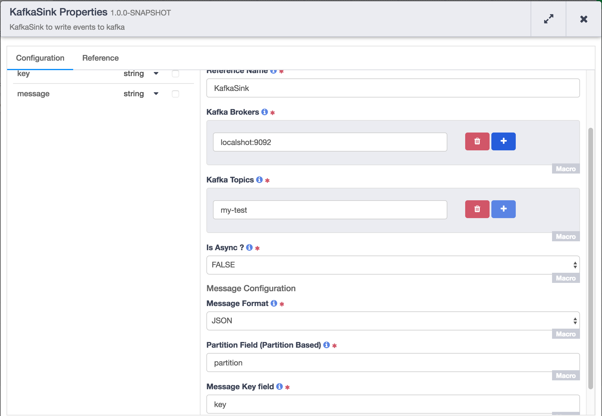

[](https://travis-ci.org/hydrator/kafka-sink) [](https://opensource.org/licenses/Apache-2.0)

Kafka Sink
==========

CDAP Plugin to write events to kafka in realtime. 




Usage Notes
-----------

Kafka sink plugin that allows you to convert a Structured Record into CSV or JSON.
Plugin has the capability to push the data to one or more Kafka topics. It can
use one of the field values from input to partition the data on topic. The sink
can also be configured to operate in either sync or async mode. 

In case of failure the failed event will not be sent to kafka topic for which it failed. 

Plugin Configuration
---------------------

| Configuration | Required | Default | Description |
| :------------ | :------: | :----- | :---------- |
| **Kafka Brokers** | **Y** | N/A | This configuration specifies kafka brokers list seperated by comma |
| **Kafka Topics** | **Y** | N/A | This configuration specifies list of kafka topics separated by comma |
| **Is Async** | **Y** | N/A | This configuration specifies whether writing the events to broker is *Asynchronous* or *Synchronous*.  |
| **Message Format** | **Y** | N/A | This configuration specifies the format of the event published to Kafka. |
| **Partition Field** | **Y** | N/A | This configuration specifies the input fields that need to be used to determine the partition id; the field type should be int or long. |
| **Message Key Field** | **Y** | N/A | This configuration specifies the input field that should be used as the key for the event published into Kafka. |


Build
-----
To build this plugin:

```
   mvn clean package
```    

The build will create a .jar and .json file under the ``target`` directory.
These files can be used to deploy your plugins.

Deployment
----------
You can deploy your plugins using the CDAP CLI:

    > load artifact <target/kafka-sink-<version>.jar config-file <target/kafka-sink<version>.json>

For example, if your artifact is named 'kafka-sink-<version>':

    > load artifact target/kafka-sink-<version>.jar config-file target/kafka-sink-<version>.json
    
## Mailing Lists

CDAP User Group and Development Discussions:

* `cdap-user@googlegroups.com <https://groups.google.com/d/forum/cdap-user>`

The *cdap-user* mailing list is primarily for users using the product to develop
applications or building plugins for appplications. You can expect questions from 
users, release announcements, and any other discussions that we think will be helpful 
to the users.

## IRC Channel

CDAP IRC Channel: #cdap on irc.freenode.net


## License and Trademarks

Copyright © 2017 Cask Data, Inc.

Licensed under the Apache License, Version 2.0 (the "License"); you may not use this file except
in compliance with the License. You may obtain a copy of the License at

http://www.apache.org/licenses/LICENSE-2.0

Unless required by applicable law or agreed to in writing, software distributed under the 
License is distributed on an "AS IS" BASIS, WITHOUT WARRANTIES OR CONDITIONS OF ANY KIND, 
either express or implied. See the License for the specific language governing permissions 
and limitations under the License.

Cask is a trademark of Cask Data, Inc. All rights reserved.

Apache, Apache HBase, and HBase are trademarks of The Apache Software Foundation. Used with
permission. No endorsement by The Apache Software Foundation is implied by the use of these marks.      
