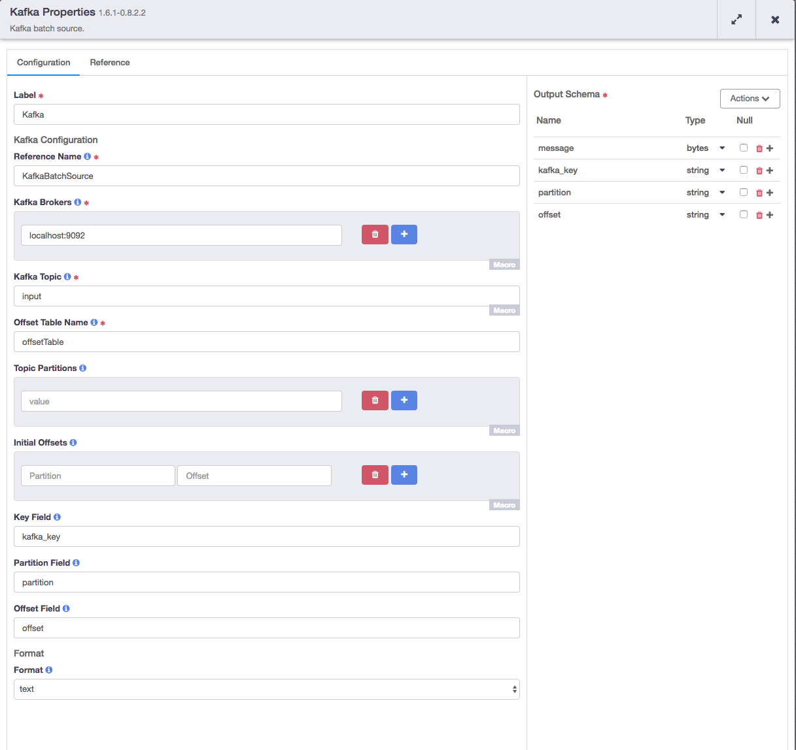

[](https://travis-ci.org/hydrator/kafka-plugins) [](https://opensource.org/licenses/Apache-2.0)

Kafka Batch Source
===========

Kafka batch source that emits a records with user specified schema.



Usage Notes
-----------

Kafka Streaming Source can be used to read events from a kafka topic. It uses kafka simple consumer [0.8.2 apis](https://kafka.apache.org/082/documentation.html) to read events from a kafka topic. Kafka Batch Source converts incoming kafka events into cdap structured records which then can be used for further transformations. 

The source will read from the earliest available offset or the initial offset that specified in the config for the first run, remember the last offset it read last run and continue from that offset for the next run. 

Plugin Configuration
---------------------

| Configuration | Required | Default | Description |
| :------------ | :------: | :----- | :---------- |
| **Kafka Brokers** | **Y** | N/A | List of Kafka brokers specified in host1:port1,host2:port2 form. |
| **Kafka Topic** | **Y** | N/A | The Kafka topic to read from. |
| **Offset Table Name** | **Y** | N/A | Optional table name to track the latest offset we read from kafka. It is recommended to name it same as the pipeline name to avoid conflict on table names. By default it will be the topic name.
| **Topic Partition** | **N** | N/A | List of topic partitions to read from. If not specified, all partitions will be read.  |
| **Initial Partition Offsets** | **N** | N/A | The initial offset for each topic partition. If this is not specified, earliest offset will be used. This offset will only be used for the first run of the pipeline. Any subsequent run will read from the latest offset from previous run.  Offsets are inclusive. If an offset of 5 is used, the message at offset 5 will be read. |
| **Key Field** | **N** | N/A | Optional name of the field containing the message key. If this is not set, no key field will be added to output records. If set, this field must be present in the schema property and must be bytes. |
| **Partition Field** | **N** | N/A | Optional name of the field containing the partition the message was read from. If this is not set, no partition field will be added to output records. If set, this field must be present in the schema property and must be an int. |
| **Offset Field** | **N** | N/A | Optional name of the field containing the partition offset the message was read from. If this is not set, no offset field will be added to output records. If set, this field must be present in the schema property and must be a long. |
| **Format** | **N** | N/A | Optional format of the Kafka event message. Any format supported by CDAP is supported. For example, a value of 'csv' will attempt to parse Kafka payloads as comma-separated values. If no format is given, Kafka message payloads will be treated as bytes. |


Build
-----
To build this plugin:

```
   mvn clean package
```    

The build will create a .jar and .json file under the ``target`` directory.
These files can be used to deploy your plugins.

Deployment
----------
You can deploy your plugins using the CDAP CLI:

    > load artifact <target/kafka-plugins-<version>.jar config-file <target/kafka-plugins<version>.json>

For example, if your artifact is named 'kafka-plugins-<version>':

    > load artifact target/kafka-plugins-<version>.jar config-file target/kafka-plugins-<version>.json
    
## Mailing Lists

CDAP User Group and Development Discussions:

* `cdap-user@googlegroups.com <https://groups.google.com/d/forum/cdap-user>`

The *cdap-user* mailing list is primarily for users using the product to develop
applications or building plugins for appplications. You can expect questions from 
users, release announcements, and any other discussions that we think will be helpful 
to the users.

## License and Trademarks

Copyright © 2017 Cask Data, Inc.

Licensed under the Apache License, Version 2.0 (the "License"); you may not use this file except
in compliance with the License. You may obtain a copy of the License at

http://www.apache.org/licenses/LICENSE-2.0

Unless required by applicable law or agreed to in writing, software distributed under the 
License is distributed on an "AS IS" BASIS, WITHOUT WARRANTIES OR CONDITIONS OF ANY KIND, 
either express or implied. See the License for the specific language governing permissions 
and limitations under the License.

Cask is a trademark of Cask Data, Inc. All rights reserved.

Apache, Apache HBase, and HBase are trademarks of The Apache Software Foundation. Used with
permission. No endorsement by The Apache Software Foundation is implied by the use of these marks.      
